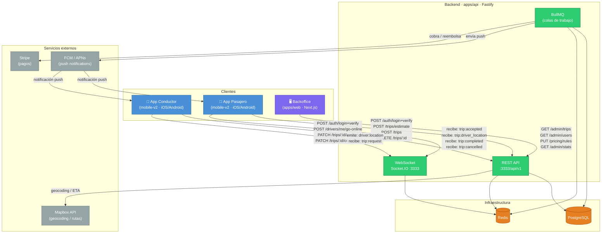

# Mobile v2 — Expo Bare Workflow · Resumen ejecutivo

## Contexto y decisión

El proyecto `apps/mobile` actual usa React Native CLI con la capa nativa Android generada manualmente (`android/`). Después de 8 sprints se identificaron tres fricciones recurrentes:

| Fricción | Impacto |
|---|---|
| `react-native-config` no autolinks en pnpm/Windows | Token Mapbox solo vía constante JS |
| Detox + Android API 37 requiere workaround de 3 installs | ~5 min overhead por suite E2E |
| Sin soporte iOS físico (sin Mac) | Imposible probar en el único dispositivo físico del equipo |

**Decisión:** Reiniciar `apps/mobile` como proyecto Expo Bare Workflow. El backend (`apps/api`) no se toca, a menos que sea estrictamente necesario. Todo el código de negocio portables (screens, stores, services) se migra directamente.

---

## Qué cambia y qué no cambia

### Se mantiene igual (portabilidad 1:1)
- `src/screens/` — 7 pantallas (Login, Home, Estimate, passengerActiveTrip, Online, driverActiveTrip, TripRequestModal)
- `src/stores/` — auth.store, driver.store, trip.store (Zustand)
- `src/services/api.client.ts` — Axios + interceptores JWT
- `src/services/socket.client.ts` — Socket.IO
- `src/navigation/RootNavigator.tsx` — lógica de routing por rol
- `context/`, `docs/`, `apps/api/` — sin cambios

### Se reemplaza (mismo contrato, diferente paquete)
| Actual | Nuevo | Razón |
|---|---|---|
| `react-native-config` | `expo-constants` + `.env` | Autolinking nativo sin pnpm symlink issues |
| `@react-native-community/geolocation` | `expo-location` | Background mode real (Task Manager) |
| `@notifee/react-native` | `expo-notifications` | Unificado con EAS |
| Detox | **Maestro** | YAML, UIAutomator, sin Espresso window-focus bug |
| Android CLI build | **EAS Build** | Cloud builds iOS + Android, sin Mac requerido |

### Se agrega (nuevo en v2)
- Background GPS via `expo-task-manager` + `TaskManager.defineTask`
- Offline queue persistida en MMKV (ya existe, se refina)
- iOS target desde sprint 1 (EAS Dev Build en iPhone físico)
- Storybook para componentes de UI

---

## Stack definitivo v2

```
Runtime:        Expo SDK 52 (Bare Workflow)
Language:       TypeScript 5 strict
Navigation:     React Navigation 7 (Stack + Bottom Tabs)
State:          Zustand 5
Maps:           @rnmapbox/maps 10 (Mapbox GL)
HTTP:           Axios 1.7
Sockets:        Socket.IO client 4
Storage:        MMKV (react-native-mmkv)
Location:       expo-location + expo-task-manager
Notifications:  expo-notifications
Config:         expo-constants + .env (dotenv)
E2E:            Maestro 1.x
CI/CD:          EAS Build + EAS Submit
```

---

## Estructura de carpetas objetivo

```
apps/mobile-v2/
├── app.json                    # Expo config (bundleId, permissions, plugins)
├── eas.json                    # EAS Build profiles (dev, preview, production)
├── .env                        # MAPBOX_PUBLIC_TOKEN, API_URL
├── src/
│   ├── screens/                # Migradas 1:1 desde mobile/src/screens
│   ├── stores/                 # Migradas 1:1
│   ├── services/               # api.client, socket.client, location.service (refactored)
│   ├── navigation/             # RootNavigator + DriverStack + PassengerStack
│   ├── components/             # Componentes reutilizables (nuevo en v2)
│   ├── config/                 # env.ts con expo-constants wrapper
│   └── hooks/                  # Custom hooks extraídos de screens
├── e2e/
│   └── flows/                  # Tests Maestro (.yaml)
│       ├── auth.yaml
│       ├── passenger.yaml
│       └── driver.yaml
└── android/                    # Generado por Expo (no tocar manualmente)
    └── app/src/main/res/
        └── values-v35/styles.xml  # Opt-out edge-to-edge Android 15+
```

---

## Diagrama de comunicación entre clientes y API



### Flujos principales por actor

| Actor | Protocolo | Dirección | Eventos clave |
|---|---|---|---|
| App Pasajero | REST | → API | login, estimate, crear viaje, cancelar |
| App Pasajero | WebSocket | ← API | `trip:accepted`, `trip:driver_location`, `trip:completed` |
| App Conductor | REST | → API | login, go-online, aceptar, completar viaje |
| App Conductor | WebSocket | ↔ API | emite `driver:location`, recibe `trip:request` |
| Backoffice | REST | → API | consultas admin, configuración de precios |
| API → BullMQ | Colas | async | push notifications, pagos Stripe, emails |

---

## Criterios de éxito del proyecto

1. App corre en iOS físico (iPhone del equipo) vía EAS Dev Build
2. App corre en Android físico/emulador sin workarounds de Espresso
3. E2E Maestro: auth + passenger + driver flows — todos PASS en CI
4. Background GPS activo mientras app está en background (validado con adb logcat)
5. Cobertura Jest: ≥75% global, 100% stores, 100% location.service
6. Build time en EAS: <15 min para iOS, <10 min para Android
